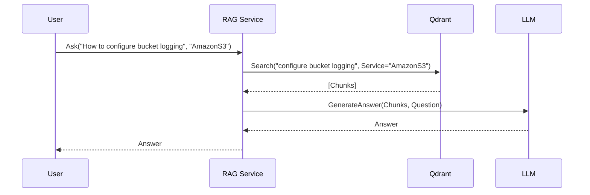
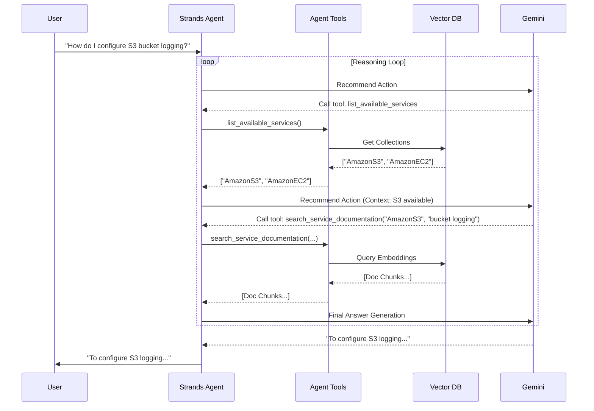

# Agents Architecture

## Overview
The AWS Doc Agent uses the [Strands](https://github.com/strands-ai/strands) library to orchestrate interactions between the user, the knowledge base, and the LLM.

## Agent Design
The agent is designed as a **Tool-Use Agent**. It has access to a set of specific tools that allow it to explore and retrieve information from the indexed AWS documentation.

### Model
- **Provider**: Google Gemini (Configurable via `GEMINI_MODEL_ID`, default: `gemini-2.0-flash`)
- **Integration**: Native `strands-agents[gemini]` support via `GeminiModel`, using `google.genai` SDK.
- **Capabilities**: Large context window (useful for RAG), fast inference.
- **Observability**: Full tracing via **Langfuse** (Input/Output, Latency, Tool usage).

### Workflows

The system supports two distinct interaction patterns:

#### 1. RAG Workflow (Direct Q&A)
*Used by the `/ask` endpoint.*

This is a linear, single-turn process ideal for simple questions where the specific AWS service context is already known (e.g., via UI selection).

1.  **Context Input**: User provides a question and a target Service (e.g., "AmazonS3").
2.  **Retrieval**: System calls `retrieve_service_docs` to find top-k relevant chunks from the Qdrant index for that service.
3.  **Synthesis**: System constructs a prompt with the chunks and asks the LLM to generate an answer.
4.  **Response**: The generated answer is returned directly.

#### 2. Agent Workflow (Adaptive Reasoning)
*Used by the `/agent` endpoint.*

This is a dynamic, multi-turn loop ideal for exploratory or complex queries where the relevant service might not be known, or multiple steps are needed.

1.  **Intent Classification**: Implicitly determined by the model.
2.  **Service Discovery**: Agent can call `list_available_services` to find out what it knows.
3.  **Topic Exploration**: Agent uses `explore_service_topics` to understand the *structure* of a service's documentation before searching.
4.  **Refined Retrieval**: Agent calls `search_service_documentation` with specific filters derived from its reasoning.
5.  **Synthesis**: Generates an answer, or decides to search again if the info was insufficient.

### Tools (Agent Only)

| Tool Name | Description | Inputs |
|-----------|-------------|--------|
| `list_available_services` | Lists all AWS services currently indexed in Qdrant. | None |
| `explore_service_topics` | Returns a list of unique header paths (contexts) for a service. | `service_name` (str) |
| `search_service_documentation` | Performs a semantic search on the vector DB, optionally filtered by context path. | `service_name` (str), `query` (str), `context_filters` (list[str]) |

## Interaction Flows

### RAG Flow (Linear)

### Agent Flow (Loop)

