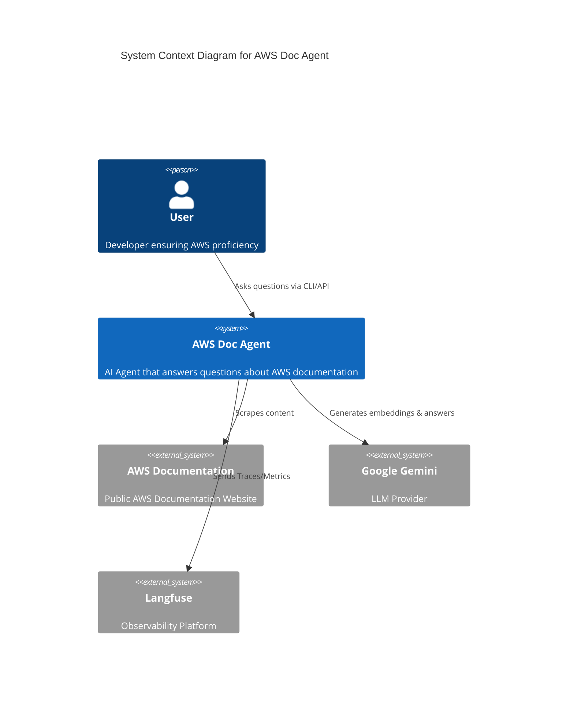
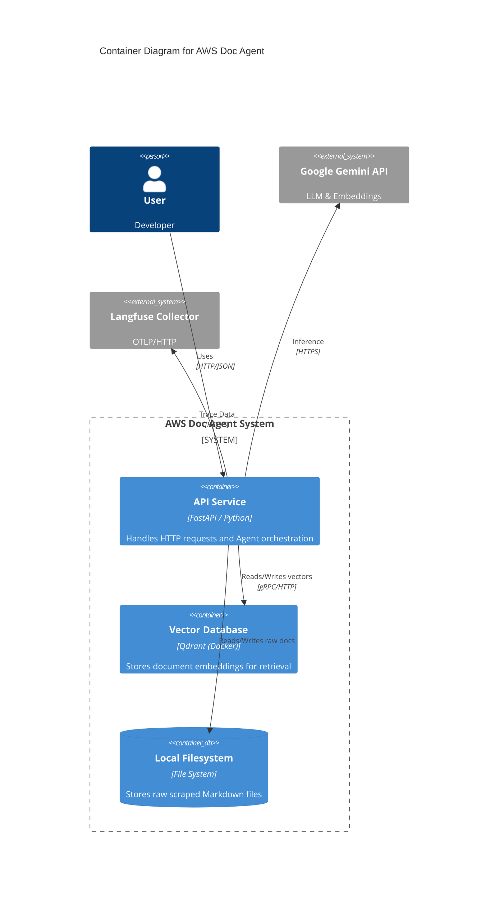
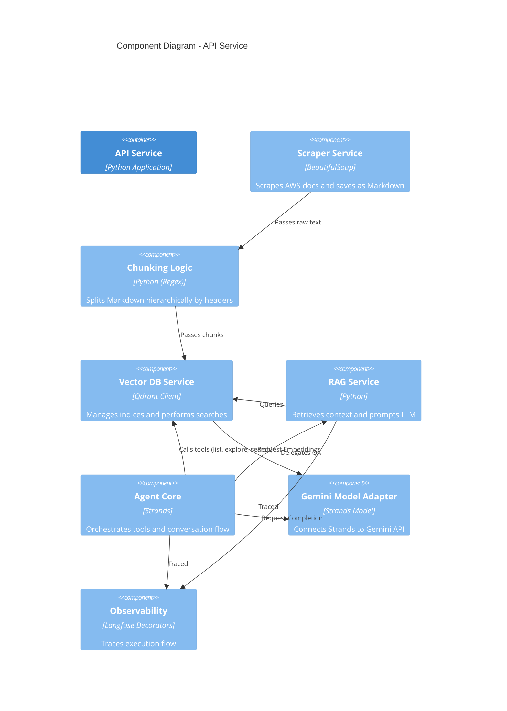

# System Architecture

## C1: System Context

```mermaid
C4Context
    title System Context Diagram for AWS Doc Agent

    Person(user, "User", "Developer ensuring AWS proficiency")
    System(aws_agent, "AWS Doc Agent", "AI Agent that answers questions about AWS documentation")
    System_Ext(aws_docs, "AWS Documentation", "Public AWS Documentation Website")
    System_Ext(gemini, "Google Gemini", "LLM Provider")
    System_Ext(langfuse, "Langfuse", "Observability Platform")

    Rel(user, aws_agent, "Asks questions via CLI/API")
    Rel(aws_agent, aws_docs, "Scrapes content")
    Rel(aws_agent, gemini, "Generates embeddings & answers")
    Rel(aws_agent, langfuse, "Sends Traces/Metrics")
```

## C2: Container Diagram

```mermaid
C4Container
    title Container Diagram for AWS Doc Agent

    Person(user, "User", "Developer")

    System_Boundary(c1, "AWS Doc Agent System") {
        Container(api, "API Service", "FastAPI / Python", "Handles HTTP requests and Agent orchestration")
        Container(qdrant, "Vector Database", "Qdrant (Docker)", "Stores document embeddings for retrieval")
        ContainerDb(fs, "Local Filesystem", "File System", "Stores raw scraped Markdown files")
    }

    System_Ext(gemini_api, "Google Gemini API", "LLM & Embeddings")
    System_Ext(langfuse_api, "Langfuse Collector", "OTLP/HTTP")

    Rel(user, api, "Uses", "HTTP/JSON")
    Rel(api, fs, "Reads/Writes raw docs")
    Rel(api, qdrant, "Reads/Writes vectors", "gRPC/HTTP")
    Rel(api, gemini_api, "Inference", "HTTPS")
    Rel(api, langfuse_api, "Trace Data", "HTTPS")
```

## C3: Component Diagram (API Service)

```mermaid
C4Component
    title Component Diagram - API Service

    Container(api, "API Service", "Python Application")

    Component(scraper, "Scraper Service", "BeautifulSoup", "Scrapes AWS docs and saves as Markdown")
    Component(chunker, "Chunking Logic", "Python (Regex)", "Splits Markdown hierarchically by headers")
    Component(vector_service, "Vector DB Service", "Qdrant Client", "Manages indices and performs searches")
    Component(rag_service, "RAG Service", "Python", "Retrieves context and prompts LLM")
    Component(agent_core, "Agent Core", "Strands", "Orchestrates tools and conversation flow")
    Component(gemini_adapter, "Gemini Model Adapter", "Strands Model", "Connects Strands to Gemini API")
    Component(observability, "Observability", "Langfuse Decorators", "Traces execution flow")

    Rel(scraper, chunker, "Passes raw text")
    Rel(chunker, vector_service, "Passes chunks")
    Rel(agent_core, vector_service, "Calls tools (list, explore, search)")
    Rel(agent_core, rag_service, "Delegates QA")
    Rel(rag_service, vector_service, "Queries")
    Rel(vector_service, gemini_adapter, "Request Embeddings")
    Rel(agent_core, gemini_adapter, "Request Completion")
    Rel(rag_service, observability, "Traced")
    Rel(agent_core, observability, "Traced")
```
