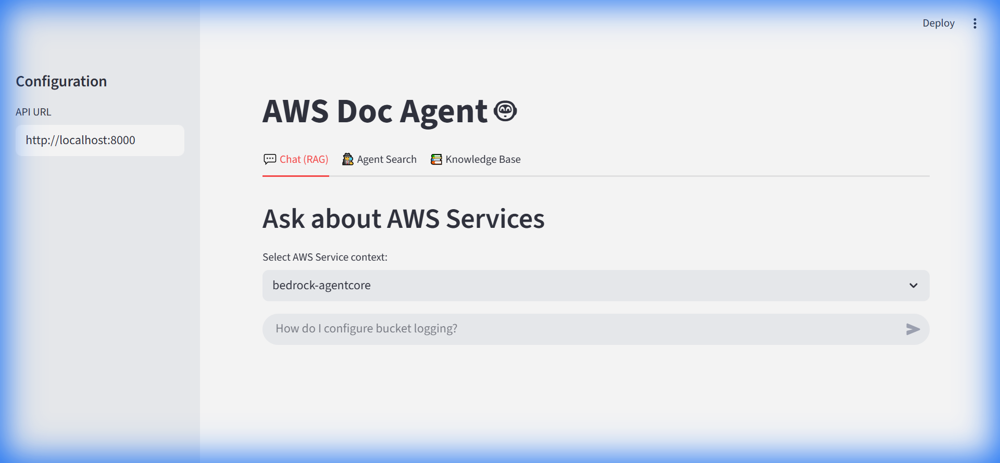
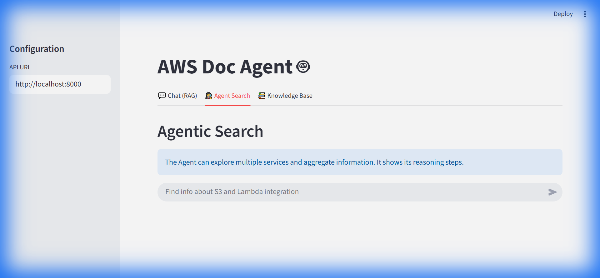
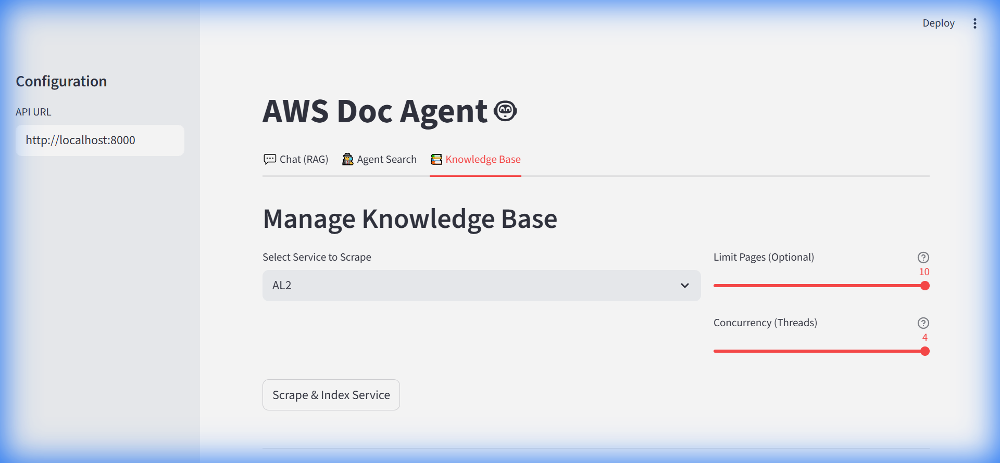

# Frontend Guide

The AWS Doc Agent provides a comprehensive Streamlit-based frontend for managing the knowledge base and interacting with the agents.

## 1. Chat (RAG) Tab

This is the primary interface for Question & Answering using Retrieval Augmented Generation (RAG).



### Features:
- **Service Selection**: Choose the AWS service context (e.g., `AmazonS3`, `lambda`).
- **Context Awareness**: The chat history is automatically cleared when you switch services to prevent context leakage.
- **Streaming Responses**: Answers are streamed in real-time.
- **History**: Maintains conversation history within the session.

---

## 2. Agent Search Tab

This tab interfaces with the autonomous **Agent** powered by `strands`. It is designed for broader exploration and multi-step reasoning.



### Features:
- **Autonomous Exploration**: The agent can plan, explore structure, and search across topics.
- **Reasoning Display**: Live updates of the agent's "thoughts" (e.g., "Explaining S3 to User", "Searching for...").
- **Reasoning Steps**: Collapsible expander showing the detailed logical steps taken by the agent.
- **Streaming**: Both the reasoning steps and the final answer are streamed.

---

## 3. Knowledge Base Tab

This tab allows you to manage the underlying data (Vector Store and Raw Files).



### Features:
- **Manage Knowledge Base (Scrape)**:
    - **Service Selection**: Select from a dynamically discovered list of all AWS services.
    - **Limit Pages**: Set a limit on pages to scrape for testing.
    - **Concurrency (Threads)**: Adjust the number of parallel threads (1-20) for faster scraping.
    - **Progress Tracking**: Real-time progress bar and log stream showing validation, scraping, and indexing status.
- **Indexed Services**:
    - Displays a list of currently indexed services.
    - **Delete**: Remove a service's index and raw files with a single click.

## Running the Frontend

To start the frontend application:

```bash
streamlit run frontend/app.py
```

The application will be accessible at `http://localhost:8501`.
